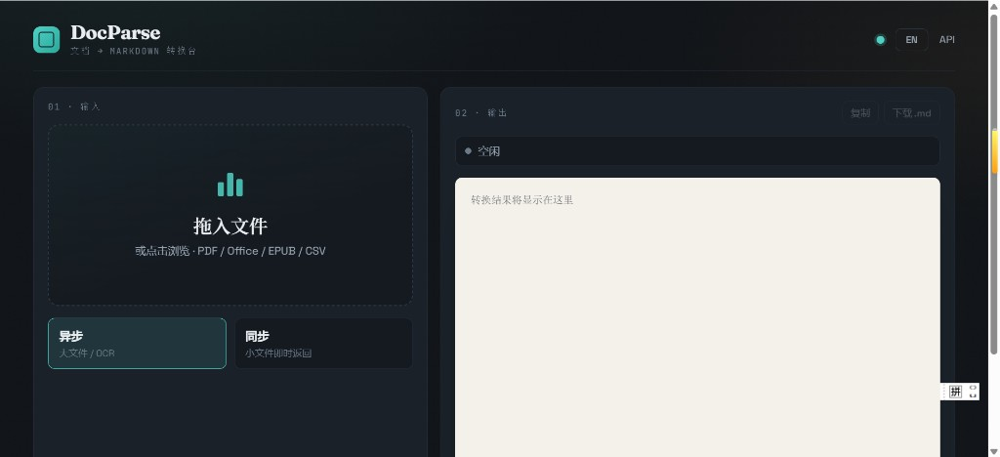
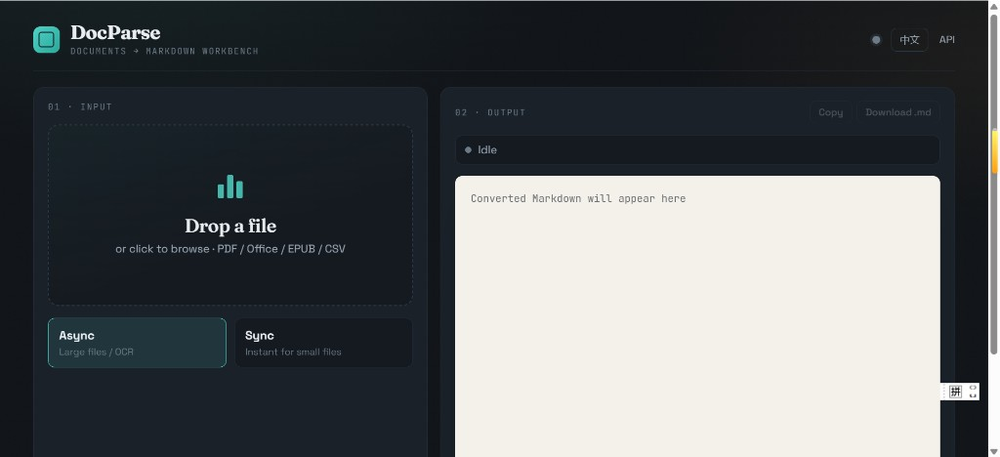

# DocParse

[中文](README.md) | [English](README_EN.md)

Unified document-to-Markdown API. Built on Firecrawl's open source libraries:

- [pdf-inspector](https://github.com/firecrawl/pdf-inspector) (MIT) - PDF classification and text extraction
- [anydoc](https://github.com/firecrawl/anydoc) (MIT) - Office / EPUB / CSV etc. to Markdown
- **RapidOCR** (optional) - local OCR for scanned pages (Chinese-friendly)

## UI

| Chinese | English |
|---------|---------|
|  |  |

## Quick start

```powershell
cd H:\work\codes\docparse
.\.venv\Scripts\activate
pip install -e ".[ocr,dev]"
uvicorn app.main:app --reload --port 8787
```

Open http://127.0.0.1:8787/ to upload files through the web UI; API docs are at http://127.0.0.1:8787/docs

## API

| Method | Path | Description |
|--------|------|-------------|
| GET | `/health` | Health check (including OCR availability) |
| POST | `/v1/parse` | Synchronous parsing (small files) |
| POST | `/v1/parse/async` | Async submission, returns `job_id` |
| GET | `/v1/jobs/{job_id}` | Query job status / result |
| POST | `/v1/detect` | Detect PDF type only (whether OCR is needed) |

### Synchronous (small files)

```powershell
curl.exe -F "file=@report.docx" http://127.0.0.1:8787/v1/parse -o out.json
```

### Async (large books / OCR)

```powershell
# 1) Submit
curl.exe -F "file=@H:/books/example.pdf" http://127.0.0.1:8787/v1/parse/async -o job.json
# Open job.json to read job_id

# 2) Poll (replace JOB_ID with the real value)
curl.exe http://127.0.0.1:8787/v1/jobs/JOB_ID -o status.json
```

When `status` is `succeeded`, `result.markdown` contains the parsed text.

## OCR

| Setting | Meaning |
|---------|---------|
| `DOCPARSE_OCR_PROVIDER=rapid` | Default; local RapidOCR |
| `DOCPARSE_OCR_PROVIDER=stub` | Only reports pages that need OCR, without recognizing them |
| `DOCPARSE_OCR_PROVIDER=none` | Skip OCR |
| `DOCPARSE_OCR_MAX_PAGES=50` | Maximum pages per OCR run |
| `DOCPARSE_OCR_SCALE=2.0` | Render resolution |
| `DOCPARSE_JOB_WORKERS=1` | Parallel job count |
| `DOCPARSE_JOBS_DIR=data/jobs` | Job storage directory |

```powershell
pip install -e ".[ocr]"
copy .env.example .env
```

## Docker (self-hosted)

```powershell
# Build the image (includes all OCR dependencies, about 1 GB)
docker build -t docparse .

# Run
docker run -d -p 8787:8787 -v docparse-data:/data --name docparse docparse

# Or use compose
docker compose up -d --build
```

Open http://127.0.0.1:8787/. Job data persists in the `docparse-data` volume; configuration can be overridden with environment variables (see `docker-compose.yml`).

## Architecture

```
upload → /v1/parse        → returns Markdown immediately
       → /v1/parse/async  → persisted queue → thread pool parsing → GET /v1/jobs/:id
                ├─ PDF  → pdf-inspector → (scanned pages) RapidOCR
                └─ other → anydoc
```

## License and acknowledgments

This project is MIT. The upstream `pdf-inspector` and `anydoc` libraries are MIT; see `NOTICE`.

## Roadmap

- [x] Real OCR integration (RapidOCR)
- [x] Async job queue (large files / OCR)
- [x] Self-hosted Docker image
- [ ] API keys and per-page billing
